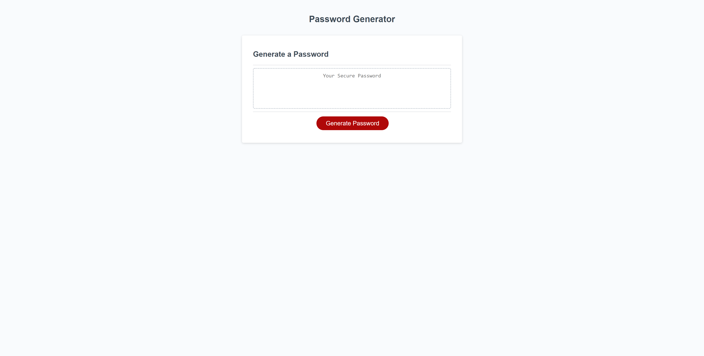

# PASSWORD GENERATOR

## CONTENTS OF THIS FILE

* Introduction
* User Story
* Acceptance Criteria
* Access
* Contribution
* Acknowledgement

## INTRODUCTION

UConn Bootcamp Weekly Challenge 3: JavaScript: Password Generator   
Create an application that can use to generate a random password based on certain criteria. This app will run in the browser, and will feature dynamically updated HTML and CSS powered by JavaScript code. 
 
Built With:
- JavaScript

## HOW TO USE

- Go to the webpage https://paperpatch.github.io/weekly-challenge-3/ and click on the button `Generate Password`. This will give you a series of window prompts.
- A list of criteria is offered:
  - Password length to be between 8 and 128 characters.
  - At least one of the four conditions needs to be met:
    - Input whether you want `lowercases` in your password.
    - Input whether you want `uppercases` in your password.
    - Input whether you want `numbers` in your password.
    - Input whether you want `special characters` in your password.
- A password will be generated and written on the page.

 

## USER STORY
AS AN employee with access to sensitive data  
I WANT to randomly generate a password that meets certain criteria  
SO THAT I can create a strong password that provides greater security  

## ACCEPTANCE CRITERIA

GIVEN I need a new, secure password  
WHEN I click the button to generate a password  
THEN I am presented with a series of prompts for password criteria  
WHEN prompted for password criteria  
THEN I select which criteria to include in the password  
WHEN prompted for the length of the password  
THEN I choose a length of at least 8 characters and no more than 128 characters  
WHEN asked for character types to include in the password  
THEN I confirm whether or not to include lowercase, uppercase, numeric, and/or special characters  
WHEN I answer each prompt  
THEN my input should be validated and at least one character type should be selected  
WHEN all prompts are answered  
THEN a password is generated that matches the selected criteria  
WHEN the password is generated  
THEN the password is either displayed in an alert or written to the page  

## ACCESS
https://paperpatch.github.io/weekly-challenge-3/

Version edits and changes can be found in Github commit changes at https://github.com/paperpatch/weekly-challenge-3/

## CONTRIBUTION
Made by Patrick Chen

## ACKNOWLEDGEMENT
UConn Bootcamp